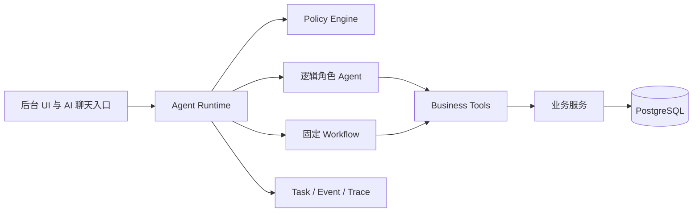

# V3 架构重建总览

> 历史快照：本目录描述的是产品演进方向，不表示当前代码路径或本轮承诺。当前会员查询实现以 `src/ai-query/`、`src/lib/server/area-resolver.ts` 和 `src/app/api/v1/members/query/route.ts` 为准。

## 目标

V3 将 Meetra 从“CRM 后台加聊天助手”演进为多入口、可治理、可恢复的 AI 红娘业务系统。CRM、NextAuth、Prisma/PostgreSQL、敏感身份字段加密和后台 UI 是保留资产；AI 执行内核重建。

## 当前与目标

V3 的原则：Agent 只处理局部不确定性；Workflow 推进确定性流程；Tool 只执行原子业务动作；Case 保存跨端业务事实；Runtime 拥有最终控制权；Policy Engine 决定是否允许动作。

## 本次整理结论

| 类别 | 处理 |
| --- | --- |
| `src/app/page.tsx` 与 `src/interface/web/components/member-workbench.tsx` | 保留会员工作台和结构化 Query Workbench |
| `/api/v1/ai/member-query` 与 `/api/v1/members/query` | AI 仅生成查询草案；服务器验证并执行结构化条件 |
| `src/lib/server/ai/` | 保留为模型适配、配置与隐私校验基础 |
| 旧聊天 Runtime、意图、语义、工具调度与专用路由 | 已从产品仓库删除；未来另行设计，不作为兼容层 |
| CRM API、Prisma、鉴权、审计、会员工作台 | 保留，待分阶段适配 |

本包是 V3 重建基线，不表示 MatchCase、任务中枢或三个业务 Agent 已实现。
