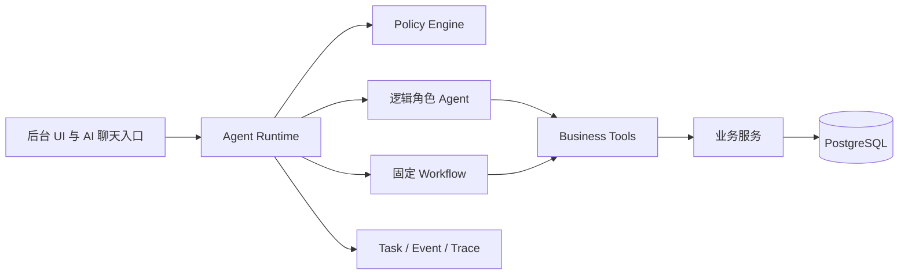

# V3 架构重建总览

> 历史快照：本目录的旧 Agent 调用链、迁移矩阵和分期计划不再约束新 Runtime。新实现以 [Agent Runtime v0.3](../agent-runtime-v0.3.md) 为准；下文保留历史，不表示当前功能状态或本轮承诺。

## 目标

V3 将 Meetra 从“CRM 后台加聊天助手”演进为多入口、可治理、可恢复的 AI 红娘业务系统。CRM、NextAuth、Prisma/PostgreSQL、敏感身份字段加密和后台 UI 是保留资产；AI 执行内核重建。

## 当前与目标

V3 的原则：Agent 只处理局部不确定性；Workflow 推进确定性流程；Tool 只执行原子业务动作；Case 保存跨端业务事实；Runtime 拥有最终控制权；Policy Engine 决定是否允许动作。

## 本次整理结论

| 类别 | 处理 |
| --- | --- |
| `src/components/ai-assistant.tsx` 与 `src/app/page.tsx` | 保留 AI 入口、悬浮球和聊天 UI，回归普通聊天 |
| `src/app/api/v1/ai/chat/route.ts` | 适配为受登录保护的纯模型聊天，不读会员数据、不调用业务工具 |
| `src/lib/server/ai/client.ts`、`config.ts`、`privacy.ts` | 保留为模型适配与配置基础 |
| 旧意图、语义、工具调度与专用 AI 路由 | 从 V3 基线移出，未来以 Runtime/Tool Registry 重建 |
| CRM API、Prisma、鉴权、审计、会员工作台 | 保留，待分阶段适配 |

本包是 V3 重建基线，不表示 MatchCase、任务中枢或三个业务 Agent 已实现。
