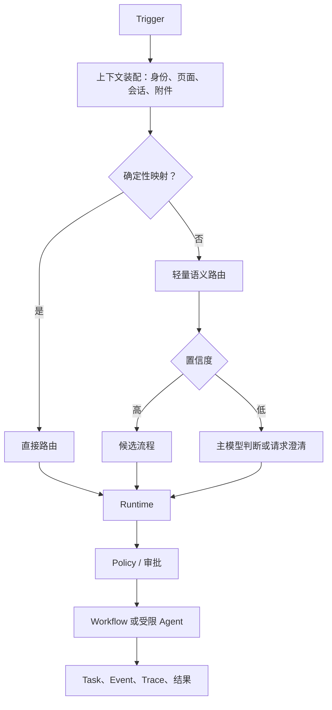

# Trigger、路由与 Runtime

## 统一 Trigger

```text
conversation_message  自然语言消息
explicit_action       按钮、标签、API 操作
scheduled_job         定时触发
domain_event          业务事实变化
session_event         长时实时会话事件
internal_task         系统内部子任务
```



Runtime 负责最大步数、最大任务跳转、无进展检测、超时、重试、暂停恢复、幂等、人工接管与异常队列。固定入口不重新猜意图，但仍要经过参数校验、Policy、审计和状态控制。
