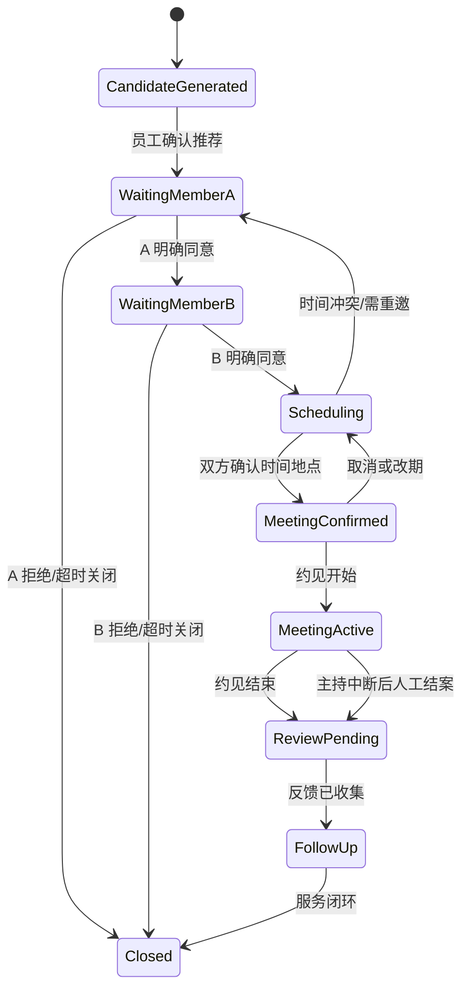

# MatchCase 状态机

```mermaid
stateDiagram-v2
  [*] --> CandidateGenerated
  CandidateGenerated --> WaitingMemberA: 员工确认推荐
  WaitingMemberA --> WaitingMemberB: A 明确同意
  WaitingMemberA --> Closed: A 拒绝/超时关闭
  WaitingMemberB --> Scheduling: B 明确同意
  WaitingMemberB --> Closed: B 拒绝/超时关闭
  Scheduling --> MeetingConfirmed: 双方确认时间地点
  Scheduling --> WaitingMemberA: 时间冲突/需重邀
  MeetingConfirmed --> MeetingActive: 约见开始
  MeetingConfirmed --> Scheduling: 取消或改期
  MeetingActive --> ReviewPending: 约见结束
  MeetingActive --> ReviewPending: 主持中断后人工结案
  ReviewPending --> FollowUp: 反馈已收集
  FollowUp --> Closed: 服务闭环
```

规则：含糊表达不等于同意；重复事件按 `idempotencyKey` 忽略；状态变迁采用乐观版本校验；同一 Case 同时只有一个活动 Task Owner；所有人工覆盖必须写入原因与审计。

Meeting Host 只读取由 Policy 生成的 `MeetingContext` 投影，不读取完整 `Member` 或内部服务备注。
